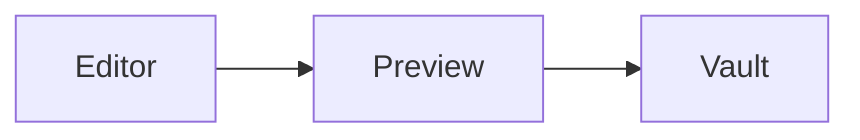

## Overview

Markdown files (`.md`, `.mdx`) open in Monaco with optional **split** or **read** preview powered by markdown-it with GFM-style extensions.

## View modes

Press `Cmd+Shift+E` / `Ctrl+Shift+E` to cycle:

1. **Edit** — Monaco only
2. **Split** — Editor + live preview
3. **Read** — Preview only

Toggle the formatting toolbar in **Settings → General**.

## Supported syntax

- Headings, bold, italic, links
- Task lists `- [ ]` / `- [x]`
- Fenced code blocks with syntax highlighting
- Images with vault-relative paths
- **Wikilinks** `[[note]]` rendered as internal links
- **Mermaid** diagrams in fenced `mermaid` blocks
- File embeds `![[other-file.md]]`

```markdown
## Architecture



See [[getting-started/quick-start]] for setup.
```

## HTML files

`.html` files use a sandboxed iframe preview instead of markdown rendering.

## Toolbar and bubble menu

When enabled, the markdown toolbar inserts bold, links, lists, and headings. A bubble menu appears on text selection in edit mode.

## Limitations

- Pipe tables may not render in all builds — verify after upgrading
- Preview uses a subset of GFM; unknown HTML passes through markdown-it rules
